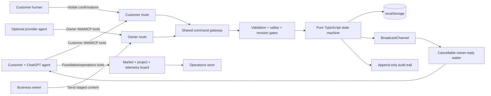
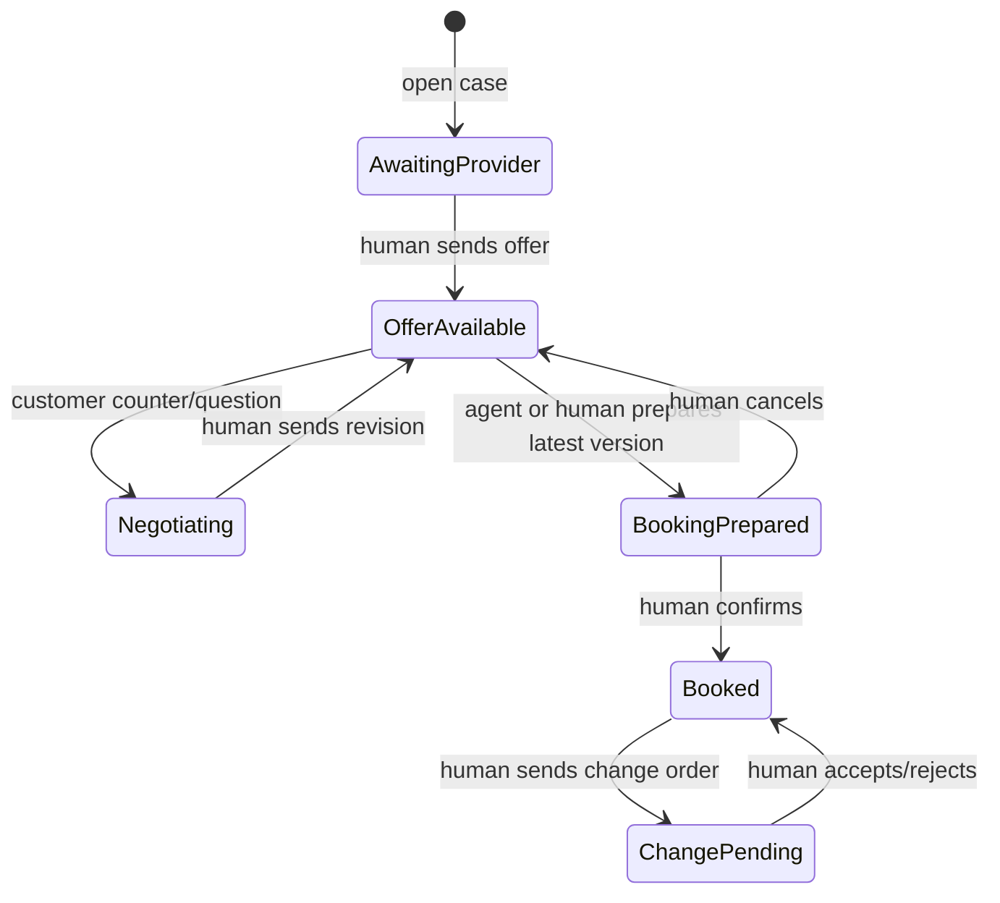

# Velaire Heating & Air

Velaire is a fictional premium HVAC service website with a WebMCP-native agreement room and service-operations board. An agent can search the site, inspect source cards and an official BLS/FRED market signal, prepare a 3–10 day project plan, open and negotiate a service case, and audit later changes or invoices. The business can stage replies and offers. Humans retain every commitment. A privacy-safe dashboard shows every browser-local tool result and handler latency live.

The synthetic HVAC demo tells one complete story:

> Service discovery → evidence check → request → owner reply → negotiation → human-approved booking → unexpected change-order comparison.

## Try it with ChatGPT

1. Open the Velaire website in an agent-enabled ChatGPT browser.
2. Keep the page open and ask in that same chat: “Use Velaire's WebMCP tools to check same-day AC service in 60614 under a $180 ceiling. Show the evidence before creating anything.”
3. Review every staged offer, booking, or change order on the page. The agent cannot complete the human approval controls.

There is no separate WebMCP account or connector to assign. The open page registers its route-specific tools automatically for the browser agent.

## Why it is WebMCP-native

The website itself exposes typed capabilities through the browser's imperative `document.modelContext.registerTool()` API. There is no separate MCP server, extension, screen scraping layer, or AgentLane runtime dependency.

- `/` and `/demo/customer` expose 13 foundation/operations tools plus 13 customer agreement tools: 26 total.
- `/demo/owner` exposes the same 13 foundation/operations tools plus 5 owner tools: 18 total.
- `/demo/operations` exposes the 13 foundation/operations tools beside the sourced chart, timeline, Kanban, and telemetry views.
- `/evidence/:sourceId` exposes one canonical evidence lookup.
- `/receipt/:receiptId` exposes one immutable receipt lookup.

Customer and owner tools are never registered together. The public storefront exposes customer capabilities so an agent can act without navigating to a hidden integration page. Route scoping is a visible demo capability boundary, not a claim of production authentication.

## Architecture



The human UI and every WebMCP handler dispatch through the same reducer. A draft can change local private state, but it cannot create a customer-visible case revision. Only the matching human Send or Confirm action commits it.



## WebMCP tools

### Shared foundation and operations surface

| Tool | Effect |
|---|---|
| `velaire_get_site_manifest` | Reads identity, routes, service area, capability groups, and boundaries. |
| `velaire_search_site` | Searches services, policies, and help; returns canonical URLs. |
| `velaire_list_services` | Lists every service, synthetic band, prerequisite, and evidence URL. |
| `velaire_get_service_details` | Reads one complete service definition. |
| `velaire_check_service_area` | Checks a postcode without collecting an exact address. |
| `velaire_get_policies` | Reads freshness-labeled pricing, availability, cancellation, and warranty cards. |
| `velaire_get_contact_options` | Returns safe service, owner-demo, and emergency routes. |
| `velaire_get_agent_help` | Returns task-specific tool order and the human authority boundary. |
| `velaire_get_market_price_context` | Reads 3–8 months of underlying BLS/FRED index values and source URLs. |
| `velaire_compare_quote_context` | Separates a fictional Velaire band check from the national cost signal. |
| `velaire_prepare_project_plan` | Prepares a visible, revision-checked 3–10 day planning draft. |
| `velaire_get_project_plan` | Reads the timeline, dependencies, proof requirements, and Kanban data. |
| `velaire_get_webmcp_health` | Reads browser-local result codes, success rate, read/action split, average, p95, and recent calls. |

### Customer agreement surface

| Tool | Effect |
|---|---|
| `velaire_check_service_fit` | Reads service-area, pricing, prerequisites, and safety fit. |
| `velaire_get_business_evidence` | Reads provenance-bearing synthetic source cards. |
| `velaire_estimate_service_range` | Builds a transparent synthetic planning range with component assumptions. |
| `velaire_get_project_preflight` | Returns a project checklist and freshness-dated official source routes. |
| `velaire_open_service_case` | Creates a bounded case; never books or charges. |
| `velaire_get_service_case` | Reads authoritative case state and valid next actions. |
| `velaire_wait_for_owner_reply` | Waits 1–20 seconds for a newer human-sent owner event. |
| `velaire_submit_case_message` | Adds a version-checked question or counteroffer. |
| `velaire_compare_offer_versions` | Deterministically compares two sent offers. |
| `velaire_prepare_booking` | Stages the latest offer for visible human confirmation. |
| `velaire_get_booking_receipt` | Reads the immutable accepted-term snapshot. |
| `velaire_compare_change_order` | Compares later scope and price against that snapshot. |
| `velaire_audit_invoice_against_receipt` | Traces invoice lines to accepted terms or approved changes. |

### Owner route

| Tool | Effect |
|---|---|
| `velaire_list_service_cases` | Reads the owner queue. |
| `velaire_get_owner_case` | Reads one authoritative case. |
| `velaire_stage_owner_reply` | Creates a private reply draft. |
| `velaire_stage_service_offer` | Creates a private structured offer draft. |
| `velaire_stage_change_order` | Creates a private structured change-order draft. |

There is intentionally no agent tool for sending an owner draft, confirming a booking, accepting changed work, or taking payment.

## Logic gates

- **Environment:** register only on the top-level document when imperative WebMCP exists.
- **Route:** customer and owner tools are isolated.
- **Input:** closed JSON Schemas plus runtime validation and bounded arrays/text.
- **HVAC safety:** gas smell, sparks, smoke, fire, or carbon-monoxide language stops ordinary booking.
- **Privacy:** schemas exclude exact addresses, payment data, phone numbers, and email addresses.
- **Revision:** state-changing tools must match the current case revision.
- **Offer:** only the latest sent and unexpired offer can be prepared.
- **Human:** sending offers, confirming booking, and deciding change orders stay in visible UI.
- **Async:** waiting is capped at 20 seconds and cleans up on `AbortSignal`.
- **Evidence:** reviews are marked synthetic, untrusted, and not independently verified.
- **Official-source freshness:** permit and incentive output states when each route was checked and refuses to decide eligibility.
- **Invoice lineage:** a charge is not treated as authorized unless it traces to the accepted offer or a human-approved change order.
- **Audit:** success and failure codes record their before/after revision effect.
- **Market truth:** the BLS/FRED series is dated and explicitly labeled national/nonresidential, never a Chicago residential quote or fairness score.
- **Project plan:** plans are browser-local drafts bounded to 3–10 days and never promise dates, crews, equipment, or inspections.
- **Observability privacy:** telemetry stores tool name, route, code, intent, and handler time only; it never logs inputs or outputs.

## Local development

Requires Node.js 24+.

```bash
npm install
npm run dev
```

Verification:

```bash
npm test
npm run typecheck
npm run build
```

Chrome's WebMCP implementation must be enabled for native discovery. Every page remains fully usable as a human workflow when the API is absent.

## Demo path

1. Open `/demo/operations`; ask the agent to inspect the sourced chart, prepare a 7-day plan, and read live WebMCP health.
2. Open `/demo/customer?judge=1` and create the pre-filled warm-air request.
3. In the judge simulator, stage a `$195` offer. Notice that the customer timeline does not change.
4. Press **Human: send offer**. The sent offer becomes revision 2.
5. Send the pre-filled `$175` counteroffer and human-send the revised offer.
6. Prepare the latest version. Then use the separate human confirmation gate.
7. Stage and human-send the `+$145` capacitor change order.
8. Review the deterministic comparison against the immutable accepted snapshot.

For a two-tab demonstration, use `/demo/customer` and `/demo/owner`; `BroadcastChannel` synchronizes the case locally.

## Deliberate boundaries

This judged build uses synthetic fixtures and browser-local persistence. It does not include real payment, calendars, Google reviews, live video analysis, Slack, WhatsApp, CRM, multi-tenant authentication, or cross-device persistence. Those integrations require consent, provider credentials, server-side authorization, provenance refresh, signed external events, and durable storage. They are documented as production extensions rather than simulated as completed features.

## Submission evidence

- [WebMCP production test report](docs/WEBMCP-TEST-REPORT.md)
- [Deployment and rollback guide](docs/DEPLOYMENT.md)
- [Advanced-tool and production-extension notes](docs/ADVANCED-TOOLS.md)
- [Copy-ready Devpost submission and demo script](SUBMISSION.md)

## Sources

- [OpenAI WebMCP documentation](https://learn.chatgpt.com/docs/webmcp)
- [WebMCP specification](https://webmachinelearning.github.io/webmcp/)
- [WebMCP Challenge rules](https://webmcp.devpost.com/rules)
- [WebMCP directory API](https://webmcp.com/api-docs)
- [City of Chicago permit guide](https://www.chicago.gov/city/en/sites/guide-to-building-permits/home.html)
- [Illinois EPA home energy rebate updates](https://epa.illinois.gov/topics/energy/energy-rebates.html)
- [ComEd incentives and financing](https://goelectric.comed.com/incentives-and-financing/)
- [ENERGY STAR federal tax credit status](https://www.energystar.gov/about/federal-tax-credits)
- [BLS producer-price methodology for plumbing and HVAC contractors](https://www.bls.gov/ppi/factsheets/producer-price-index-data-for-nonresidential-building-construction-sector-contractors-naics-238.htm)
- [FRED series PCU23822X23822X](https://fred.stlouisfed.org/series/PCU23822X23822X)

MIT licensed. All businesses, people, reviews, credentials, prices, bookings, and records in the demo are fictional.
