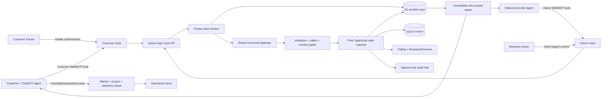
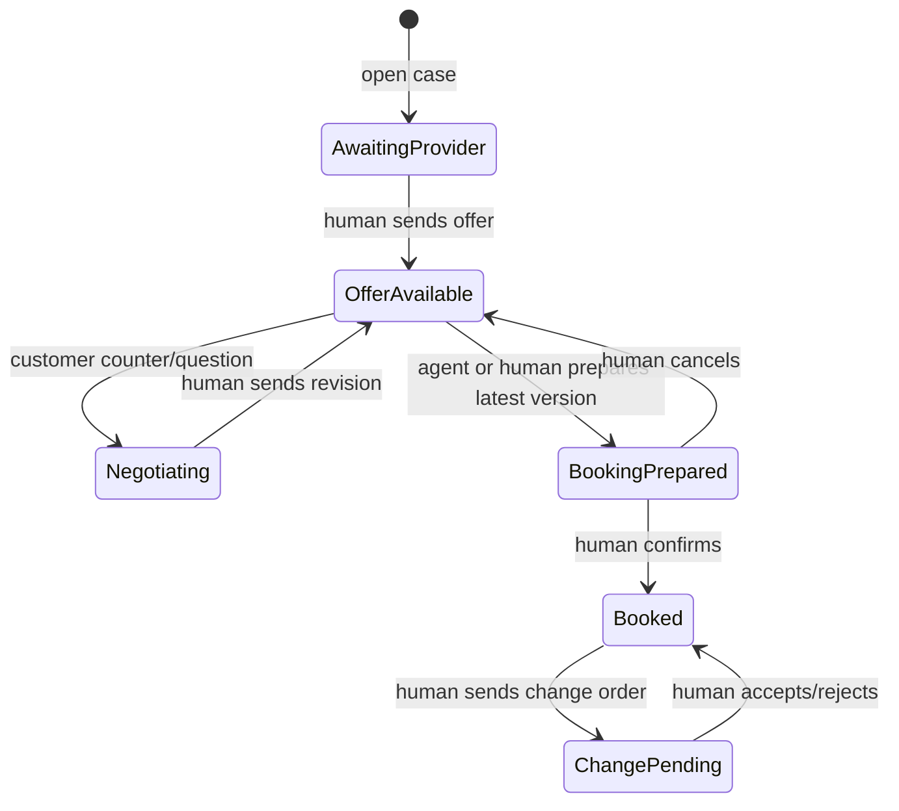

# Velaire Heating & Air

Velaire is a fictional premium HVAC service website with a WebMCP-native agreement room and service-operations board. Separate customer and owner agents can collaborate through one durable service case while each human retains every commitment. Agents can search the site, inspect source cards and an official BLS/FRED market signal, prepare a 3–10 day project plan, negotiate, and audit later changes or invoices. A privacy-safe dashboard shows browser-local tool results and handler latency live.

The synthetic HVAC demo tells one complete story:

> Service discovery → evidence check → request → owner reply → negotiation → human-approved booking → unexpected change-order comparison.

## Try it with ChatGPT

For the exact two-chat screen setup, natural-language prompts, word-for-word narration, expected results, and recovery branches, use [`DEMO-RUNBOOK.md`](DEMO-RUNBOOK.md).

1. In customer ChatGPT chat A, open `/demo/customer` and ask naturally: “My AC is blowing warm air in 60614, I can spend up to $180, and I need help today. Can Velaire help? Show me the evidence before opening a synthetic case.”
2. Copy the private owner invite shown after creation and open it in owner ChatGPT chat B.
3. Let the owner agent stage a reply or offer, then let the owner press the visible **Send** control.
4. Ask the customer agent whether the owner replied. It can retrieve the new revision and return structured terms, the case graph, a clearly labeled planning arrival range, and map routes.
5. Review every booking or changed-work decision on its own page. Neither agent has an approval tool.

There is no separate WebMCP account or connector to assign. The open page registers its route-specific tools automatically for the browser agent.

## Why it is WebMCP-native

The website itself exposes typed capabilities through the browser's imperative `document.modelContext.registerTool()` API. There is no separate remote MCP server, extension, screen-scraping layer, or AgentLane runtime dependency. A same-origin case API persists the shared business state; it does not replace the page-native WebMCP surface.

- `/` and `/demo/customer` expose 13 foundation/operations tools plus 16 customer agreement tools: 29 total.
- `/demo/owner` exposes the same 13 foundation/operations tools plus 6 owner tools: 19 total.
- `/demo/operations` exposes the 13 foundation/operations tools beside the sourced chart, timeline, Kanban, and telemetry views.
- `/evidence/:sourceId` exposes one canonical evidence lookup.
- `/receipt/:receiptId` exposes one immutable receipt lookup.

Customer and owner tools are never registered together. The public storefront exposes customer capabilities so an agent can act without navigating to a hidden integration page. Route scoping is a visible demo capability boundary, not a claim of production authentication.

## Architecture



The human UI and every WebMCP handler dispatch through the same reducer. Role-specific capability URLs address one D1-backed case, and only token hashes are stored. A private draft cannot create a customer-visible revision; only the matching human Send or Confirm action commits it.



## WebMCP tools

### Shared foundation and operations surface

| Tool | Effect |
|---|---|
| `velaire_get_site_manifest` | Reads identity, routes, service area, capability groups, and boundaries. |
| `velaire_search_site` | Searches services, policies, and help; returns canonical URLs. |
| `velaire_list_services` | Lists every service, synthetic band, prerequisite, and evidence URL. |
| `velaire_get_service_details` | Reads one complete service definition. |
| `velaire_check_service_area` | Checks a postcode without collecting an exact address. |
| `velaire_get_policies` | Reads freshness-labeled pricing, availability, cancellation, and warranty cards. |
| `velaire_get_contact_options` | Returns safe service, owner-demo, and emergency routes. |
| `velaire_get_agent_help` | Returns task-specific tool order and the human authority boundary. |
| `velaire_get_market_price_context` | Reads 3–8 months of underlying BLS/FRED index values and source URLs. |
| `velaire_compare_quote_context` | Separates a fictional Velaire band check from the national cost signal. |
| `velaire_prepare_project_plan` | Prepares a visible, revision-checked 3–10 day planning draft. |
| `velaire_get_project_plan` | Reads the timeline, dependencies, proof requirements, and Kanban data. |
| `velaire_get_webmcp_health` | Reads browser-local result codes, success rate, read/action split, average, p95, and recent calls. |

### Customer agreement surface

| Tool | Effect |
|---|---|
| `velaire_check_service_fit` | Reads service-area, pricing, prerequisites, and safety fit. |
| `velaire_get_business_evidence` | Reads provenance-bearing synthetic source cards. |
| `velaire_estimate_service_range` | Builds a transparent synthetic planning range with component assumptions. |
| `velaire_get_project_preflight` | Returns a project checklist and freshness-dated official source routes. |
| `velaire_open_service_case` | Creates a bounded case; never books or charges. |
| `velaire_get_service_case` | Reads authoritative case state and valid next actions. |
| `velaire_set_service_location` | Stores customer-supplied location text only with explicit confirmation; never geocodes it. |
| `velaire_get_case_visuals` | Returns graph nodes, edges, Mermaid text, a canonical graph URL, and map-search URLs. |
| `velaire_plan_service_route` | Returns Google/Apple driving links and a transparent synthetic arrival-planning band from the fictional Chicago dispatch area. |
| `velaire_wait_for_owner_reply` | Waits up to 15 seconds for a newer owner event and returns a cursor for bounded cooperative re-polling. |
| `velaire_submit_case_message` | Adds a version-checked question or counteroffer. |
| `velaire_compare_offer_versions` | Deterministically compares two sent offers. |
| `velaire_prepare_booking` | Stages the latest offer for visible human confirmation. |
| `velaire_get_booking_receipt` | Reads the immutable accepted-term snapshot. |
| `velaire_compare_change_order` | Compares later scope and price against that snapshot. |
| `velaire_audit_invoice_against_receipt` | Traces invoice lines to accepted terms or approved changes. |

### Owner route

| Tool | Effect |
|---|---|
| `velaire_list_service_cases` | Reads the owner queue. |
| `velaire_get_owner_case` | Reads one authoritative case. |
| `velaire_stage_owner_reply` | Creates a private reply draft. |
| `velaire_stage_service_offer` | Creates a private structured offer draft. |
| `velaire_stage_change_order` | Creates a private structured change-order draft. |
| `velaire_wait_for_customer_reply` | Waits up to 15 seconds for a newer customer event and returns a re-poll cursor. |

There is intentionally no agent tool for sending an owner draft, confirming a booking, accepting changed work, or taking payment.

## Logic gates

- **Environment:** register only on the top-level document when imperative WebMCP exists.
- **Route:** customer and owner tools are isolated.
- **Input:** closed JSON Schemas plus runtime validation and bounded arrays/text.
- **HVAC safety:** gas smell, sparks, smoke, fire, or carbon-monoxide language stops ordinary booking.
- **Privacy:** schemas exclude payment data, phone numbers, and email addresses. Customer-supplied service-location text requires explicit confirmation and is returned only as unverified map-search or directions input.
- **Route truth:** route URLs are real map-provider links; the displayed travel band is synthetic demo planning data, never live traffic, technician tracking, or an arrival promise.
- **Revision:** state-changing tools must match the current case revision.
- **Offer:** only the latest sent and unexpired offer can be prepared.
- **Human:** sending offers, confirming booking, and deciding change orders stay in visible UI.
- **Async:** each wait is capped at 15 seconds, cleans up on `AbortSignal`, and can be cooperatively repeated for at most 120 seconds. The browser host may end any call.
- **Capability:** customer and owner links carry separate random bearer capabilities; the database stores only their SHA-256 hashes.
- **Evidence:** reviews are marked synthetic, untrusted, and not independently verified.
- **Official-source freshness:** permit and incentive output states when each route was checked and refuses to decide eligibility.
- **Invoice lineage:** a charge is not treated as authorized unless it traces to the accepted offer or a human-approved change order.
- **Audit:** success and failure codes record their before/after revision effect.
- **Market truth:** the BLS/FRED series is dated and explicitly labeled national/nonresidential, never a Chicago residential quote or fairness score.
- **Project plan:** plans are browser-local drafts bounded to 3–10 days and never promise dates, crews, equipment, or inspections.
- **Observability privacy:** telemetry stores tool name, route, code, intent, and handler time only; it never logs inputs or outputs.

## Local development

Requires Node.js 24+.

```bash
npm install
npm run dev
```

Verification:

```bash
npm test
npm run typecheck
npm run build
```

Chrome's WebMCP implementation must be enabled for native discovery. Every page remains fully usable as a human workflow when the API is absent.

## Demo path

1. In customer ChatGPT chat A, open `/demo/customer`, create the pre-filled warm-air request, and copy its owner invite.
2. In owner ChatGPT chat B, open that private invite. Ask the owner agent to stage the `$195` offer, then press **Human: send offer**.
3. In chat A, ask “Has the owner replied, and can you show the case history and driving plan?” It receives revision 2 and selects the right retrieval, visual, and route capabilities from that intent.
4. Ask chat A to counter at `$175`. In chat B, ask whether the customer replied, stage the revised offer, and human-send it.
5. In chat A, compare versions, prepare the latest version, and use the separate human confirmation gate.
6. In chat B, stage and human-send the `+$145` capacitor change order. In chat A, compare it against the immutable receipt.

The prompts deliberately do not name tools. Tool titles and descriptions map ordinary customer or owner intent to the correct capability. The backend, not tab-local storage, synchronizes the private role URLs; the page poll keeps both views current while bounded wait tools provide agent-side retrieval.

## Deliberate boundaries

This judged build uses synthetic fixtures and a durable D1-backed demo case. Capability links permit separate devices/chats, but they are not production identity or tenant authentication. The build does not include real payment, calendars, Google reviews, live video analysis, Slack, WhatsApp, or CRM. Those integrations require consent, provider credentials, stronger server-side authorization, provenance refresh, and signed external events; they are documented as extensions rather than simulated as completed features.

## Submission evidence

- [WebMCP production test report](docs/WEBMCP-TEST-REPORT.md)
- [Deployment and rollback guide](docs/DEPLOYMENT.md)
- [Advanced-tool and production-extension notes](docs/ADVANCED-TOOLS.md)
- [Copy-ready Devpost submission and demo script](SUBMISSION.md)

## Sources

- [OpenAI WebMCP documentation](https://learn.chatgpt.com/docs/webmcp)
- [WebMCP specification](https://webmachinelearning.github.io/webmcp/)
- [WebMCP Challenge rules](https://webmcp.devpost.com/rules)
- [WebMCP directory API](https://webmcp.com/api-docs)
- [City of Chicago permit guide](https://www.chicago.gov/city/en/sites/guide-to-building-permits/home.html)
- [Illinois EPA home energy rebate updates](https://epa.illinois.gov/topics/energy/energy-rebates.html)
- [ComEd incentives and financing](https://goelectric.comed.com/incentives-and-financing/)
- [ENERGY STAR federal tax credit status](https://www.energystar.gov/about/federal-tax-credits)
- [BLS producer-price methodology for plumbing and HVAC contractors](https://www.bls.gov/ppi/factsheets/producer-price-index-data-for-nonresidential-building-construction-sector-contractors-naics-238.htm)
- [FRED series PCU23822X23822X](https://fred.stlouisfed.org/series/PCU23822X23822X)

MIT licensed. All businesses, people, reviews, credentials, prices, bookings, and records in the demo are fictional.
