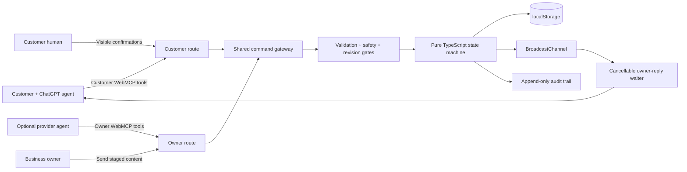
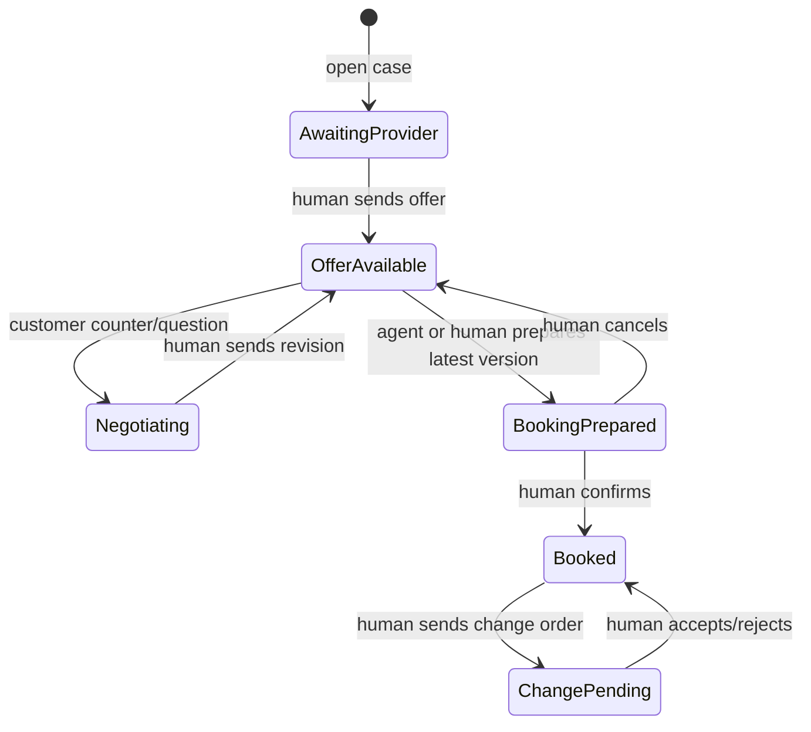

# PromiseDiff

PromiseDiff is a WebMCP-native agreement room for local service businesses. A customer agent can discover services, inspect source cards, open a case, negotiate structured terms, prepare a booking, and compare changed work. The business can stage replies and offers. Humans retain every commitment.

The synthetic HVAC demo tells one complete story:

> Service discovery → evidence check → request → owner reply → negotiation → human-approved booking → unexpected change-order comparison.

## Why it is WebMCP-native

The website itself exposes typed capabilities through the browser's imperative `document.modelContext.registerTool()` API. There is no separate MCP server, extension, screen scraping layer, or AgentLane runtime dependency.

- `/demo/customer` exposes 10 customer tools.
- `/demo/owner` exposes 5 owner tools.
- `/evidence/:sourceId` exposes one canonical evidence lookup.
- `/receipt/:receiptId` exposes one immutable receipt lookup.
- `/` exposes no tools.

Customer and owner tools are never registered together. Route scoping is a visible demo capability boundary, not a claim of production authentication.

## Architecture



The human UI and every WebMCP handler dispatch through the same reducer. A draft can change local private state, but it cannot create a customer-visible case revision. Only the matching human Send or Confirm action commits it.



## WebMCP tools

### Customer route

| Tool | Effect |
|---|---|
| `promisediff_check_service_fit` | Reads service-area, pricing, prerequisites, and safety fit. |
| `promisediff_get_business_evidence` | Reads provenance-bearing synthetic source cards. |
| `promisediff_open_service_case` | Creates a bounded case; never books or charges. |
| `promisediff_get_service_case` | Reads authoritative case state and valid next actions. |
| `promisediff_wait_for_owner_reply` | Waits 1–20 seconds for a newer human-sent owner event. |
| `promisediff_submit_case_message` | Adds a version-checked question or counteroffer. |
| `promisediff_compare_offer_versions` | Deterministically compares two sent offers. |
| `promisediff_prepare_booking` | Stages the latest offer for visible human confirmation. |
| `promisediff_get_booking_receipt` | Reads the immutable accepted-term snapshot. |
| `promisediff_compare_change_order` | Compares later scope and price against that snapshot. |

### Owner route

| Tool | Effect |
|---|---|
| `promisediff_list_service_cases` | Reads the owner queue. |
| `promisediff_get_owner_case` | Reads one authoritative case. |
| `promisediff_stage_owner_reply` | Creates a private reply draft. |
| `promisediff_stage_service_offer` | Creates a private structured offer draft. |
| `promisediff_stage_change_order` | Creates a private structured change-order draft. |

There is intentionally no agent tool for sending an owner draft, confirming a booking, accepting changed work, or taking payment.

## Logic gates

- **Environment:** register only on the top-level document when imperative WebMCP exists.
- **Route:** customer and owner tools are isolated.
- **Input:** closed JSON Schemas plus runtime validation and bounded arrays/text.
- **HVAC safety:** gas smell, sparks, smoke, fire, or carbon-monoxide language stops ordinary booking.
- **Privacy:** schemas exclude exact addresses, payment data, phone numbers, and email addresses.
- **Revision:** state-changing tools must match the current case revision.
- **Offer:** only the latest sent and unexpired offer can be prepared.
- **Human:** sending offers, confirming booking, and deciding change orders stay in visible UI.
- **Async:** waiting is capped at 20 seconds and cleans up on `AbortSignal`.
- **Evidence:** reviews are marked synthetic, untrusted, and not independently verified.
- **Audit:** success and failure codes record their before/after revision effect.

## Local development

Requires Node.js 24+.

```bash
npm install
npm run dev
```

Verification:

```bash
npm test
npm run typecheck
npm run build
```

Chrome's WebMCP implementation must be enabled for native discovery. Every page remains fully usable as a human workflow when the API is absent.

## Demo path

1. Open `/demo/customer?judge=1` and create the pre-filled warm-air request.
2. In the judge simulator, stage a `$195` offer. Notice that the customer timeline does not change.
3. Press **Human: send offer**. The sent offer becomes revision 2.
4. Send the pre-filled `$175` counteroffer.
5. Stage and human-send the revised `$175` offer.
6. Prepare the latest version. Then use the separate human confirmation gate.
7. Stage and human-send the `+$145` capacitor change order.
8. Review the deterministic comparison against the immutable accepted snapshot.

For a two-tab demonstration, use `/demo/customer` and `/demo/owner`; `BroadcastChannel` synchronizes the case locally.

## Deliberate boundaries

This judged build uses synthetic fixtures and browser-local persistence. It does not include real payment, calendars, Google reviews, Slack, WhatsApp, CRM, multi-tenant authentication, or cross-device persistence. A production owner route requires server-side identity, authorization, signed external event handling, and durable storage.

## Sources

- [OpenAI WebMCP documentation](https://learn.chatgpt.com/docs/webmcp)
- [WebMCP specification](https://webmachinelearning.github.io/webmcp/)
- [WebMCP Challenge rules](https://webmcp.devpost.com/rules)
- [WebMCP directory API](https://webmcp.com/api-docs)

MIT licensed. All businesses, people, reviews, credentials, prices, bookings, and records in the demo are fictional.
